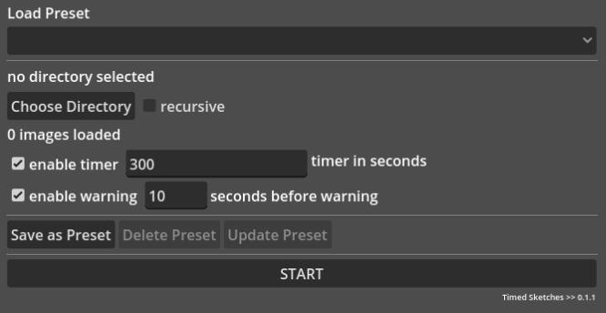

# Timed Sketches

This is a quick and dirty application that will load images from a specified folder, randomize the order of those files, and then display them against a timer for timed drawing from reference.

It is very barebones and written to be a slim application for my personal use. I've made no efforts to make this functional for others, though it should be useable "out of the box" given that I'm using default Godot functionality for everything.

### Session Setup

Preset dropdown should auto populate if any presets have been saved locally.

Choose a directory, if there are any images in the direction it will show in the `images loaded` label. Checking `recursive` will search all directories within the selected directory.

`enable timer` to have the application automatically advance images. This can be set as low as one second or as high as 359999 (99 hours, 59 minutes, and 59 seconds). A reasonable number is probably somewhere between 10 and 3600 seconds (1 hour).

`enable warning` will play a chime before auto advancing to the next image. This can be set between 1 and 59 seconds. Requires `enable timer` to function.

Sessions can be saved and loaded again in the future. Session preset management allows saving, editing, and deleting presets.

`START` will launch in to the image view. It will not move forward if any of the following are true:
- no directory has been selected
- the selected directory has no images in it
- the timer is enabled, but is not a valid number between 1 and 359999
- the warning is enabled, but is not a valid number between 1 and 59

### Timed Sketch View

Once started, the application moves to automatically loading images. If the timer is enabled, it will automatically load the next image when the timer expires, resetting the timer for the new image. This will continue until all images have been displayed or the user exits the application.

The user can advance images manually or go backward through the list using keyboard inputs. The timer will reset every time the image is changed, if enabled.

If the timer is not enabled, images will not auto advance. The user can manually advance images or go back through the list using keyboard inputs.

Keyboard Inputs:

- move forward an image - right arrow
- move back an image - left arrow
- pause/resume timer - space bar
- return to config screen - q

### Future Considerations

- add vs code debug profile (for my own convenience)
- Session Setup
	- number of images to study -> to limit study session
	- add some keyboard shortcuts
	- auto sort presets alphabetically?
	- temporarily display any validation errors -> no images available, invalid timers, that kind of business
- Timed Sketch View
	- show # (index) of current file / total number of files (or study limit number)